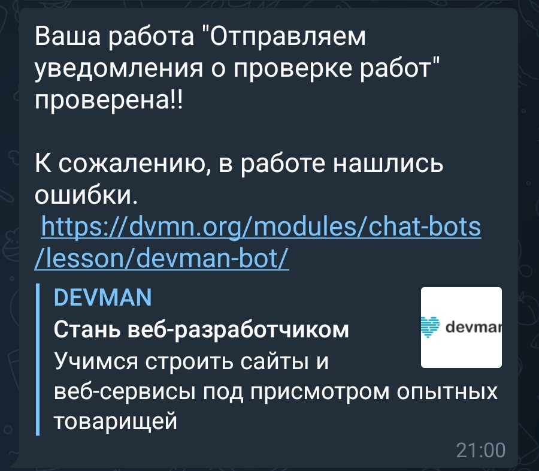

# devman_bot

Этот проект нужен для оповещения о проверенных работах на учебном сервисе [https://dvmn.org](https://dvmn.org). 

Проект содержит один скрипт:
* `main.py` - Скрипт проверяет изменения в статусе проверки работ по средством API и отправляет данные в чат телеграмм бота по chat_id.
## Пример сообщения телеграмм бота.



## Как он работает:

1. `main.py`
   Вы запускаете скрипт командой ниже, и он посылает запрос к API. Сервер ответит не сразу, 
   а только когда изменится статус проверки работ. В этом случает скрипт достанет из ответа, данные о проверке: 
   название, время изменения статуса, статус проверки, ссылку на урок и передаст данные через телеграмм бота в чат 
   ученика.

```python
python3 main.py
```

2. Так же можно скрипт запустить в докер контейнере (предварительно нужно 
   создать контейнер или скачать его из репозитория), командой:

```python
sudo docker run -d devman_bot:v1
```

## Установка

Используйте данную инструкцию по установке этого скрипта

1. Установить

```python
git clone https://github.com/Maxim-Pekov/devman_bot.git
```

2. Создайте виртуальное окружение:

```python
python -m venv venv
```

3. Активируйте виртуальное окружение:
```python
.\venv\Scripts\activate`    # for Windows
```
```python
source ./.venv/bin/activate    # for Linux
```

4. Установите зависимости командой ниже:
```python
pip install -r devman_bot/requirements.txt
```

5. Создайте файл с названием `.env`

6. Запишите в данном файле, ваш API токен с сайта DEVMAN, телеграмм токен 
   вашего бота и номер вашего чата с ботом в формате 
   как в примере ниже.
```python
DEVMAN_TOKEN='33222728d3925fc31t3e955555wj8206k95h111'
TOKEN_TG='559475638:AQweRTZdfKiJnm0AitjQ196u_n6GHjSD000'
TG_CHAT_ID='741414001'
```
7. Для создания контейнера нужно установить предварительно докер, 
   воспользуйтесь скриптом ниже для установки docker для ОС Ubuntu:

```python
curl -fsSL https://get.docker.com -o get-docker.sh
sudo sh get-docker.sh
```

8. Что бы создать контейнер воспользуйтесь командами:

```python
sudo docker build -t devman_bot:v2 devman_bot/
```

9. Если вы хотите скачать уже готовый контейнер с ботом, то воспользуйтесь 
   командой:

```python
docker pull fenixx/devman_bot:v2
```

10. При запуске контейнера таким способом нужно передать свои переменные 
    окружения:

```python
sudo docker run -d --restart always 
-e DEVMAN_TOKEN='33811728b3925fac31e3f92d7b9fc00000000' 
-e TOKEN_TG='5555537785:AAGfRtZdfDiWQY0AmeuA196u_z6FIg00000' 
-e TG_CHAT_ID='741200000' fenixx/devman_bot:v2
```

---

## About me

[https://www.linkedin.com/in/maxim-pekov/](https://www.linkedin.com/in/maxim-pekov/)
</br>

[https://t.me/MaxPekov/](https://t.me/MaxPekov/)
</br>

[//]: # (Карточка профиля: )


[//]: # (Статистика языков в коммитах:)

[//]: # (Статистика языков в репозиториях:)


[//]: # (Статистика профиля:)

[//]: # (Данные по коммитам за сутки:)


[//]: # ([![trophy]&#40;https://github-profile-trophy.vercel.app/?username=Maxim-Pekov&#41;]&#40;https://github.com/ryo-ma/github-profile-trophy&#41;)

